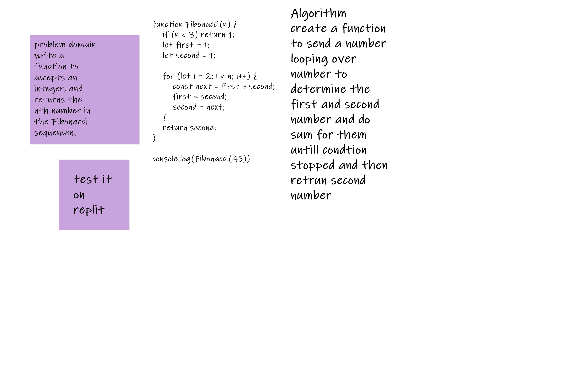

function fib(n) {
    if (n < 3) return 1;
    let prev = 1; //1
    let curr = 1; //1
    //i=2
    for (let i = 2; i < n; i++) {
        const next = prev + curr; //1+1=2
        prev = curr;//1
        curr = next;//2
    }
    return curr
}

