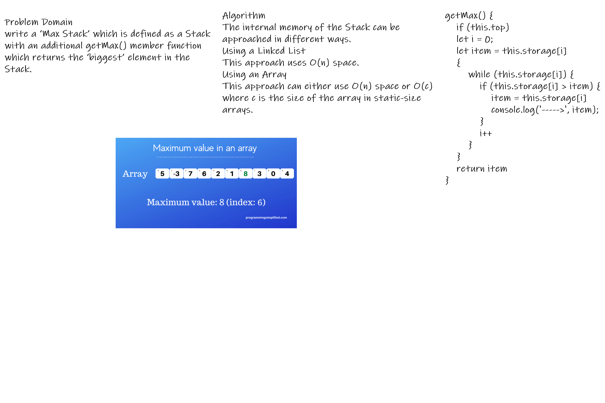
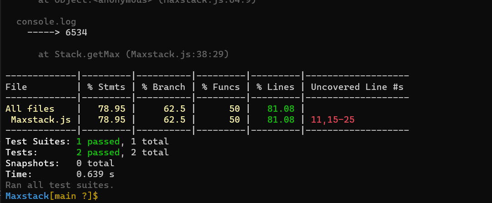

Interview 01

Max stack. Write a method that returns the “biggest” element in a stack.

Specifications
Read all of the following instructions carefully.
Act as an interviewer, giving a candidate a code challenge
Score the candidate according to the Whiteboard Rubric
You are free to offer suggestions or guidance (and see how they respond), but don’t solve it for the candidate
Feature Tasks
Ask the candidate to write a ‘Max Stack’ which is defined as a Stack with an additional getMax() member function which returns the ‘biggest’ element in the Stack.
The candidate can assume that only numeric values will be stored in the Stack, but she/he has to ask before the interviewer can state this.
The internal memory of the Stack can be approached in different ways.
Using a Linked List
This approach uses O(n) space.
Using an Array
This approach can either use O(n) space or O(c) where c is the size of the array in static-size arrays.
If your language doesn’t support dynamic arrays,Inquire about the candidate’s decision of using a limited amount of storage for the Stack.
Using a Node class and manually creating connections by maintaining a reference to the ‘top’ of the stack.
This approach uses O(n) spac

This solution takes O(n) time and uses O(n) space.

 
 