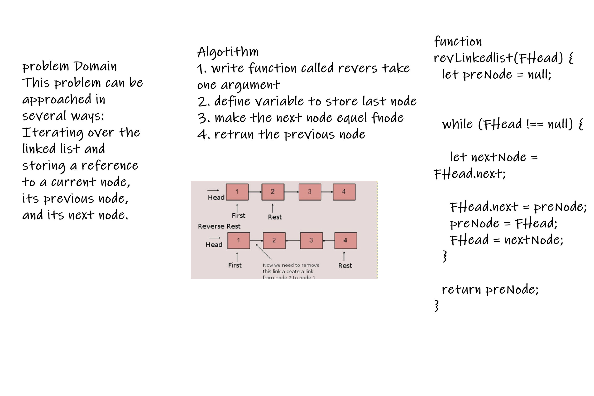

## Interview 01

Reverse a Linked List.

- Specifications
Read all of the following instructions carefully.
Act as an interviewer, giving a candidate a code challenge
Score the candidate according to the Whiteboard Rubric
You are free to offer suggestions or guidance (and see how they respond), but don’t solve it for the candidate
Feature Tasks

-  Ask the candidate to write a function to reverse a Singly Linked List.
Avoid utilizing any of the built-in methods available in your language.
Attempt to guide the candidate to an in-place solution (i.e. avoid creating a copy of the Linked List).
This problem can be approached in several ways:
Iterating over the linked list and storing a reference to a current node, its previous node, and its next node.
In every iteration, after the next node is stored, the current’s node next pointer is pointed at the stored reference to the previous node.
This solution takes O(n) time and uses O(1) extra space.
A recursive solution that reverses the body of the link list before re-connecting the head.
This solution takes O(n) time and uses O(n) space on the call stack.
Creating a copy of the linked list, inserting elements at the head of the new list.
This solution takes O(n) time and uses O(n) space.

 
  
 