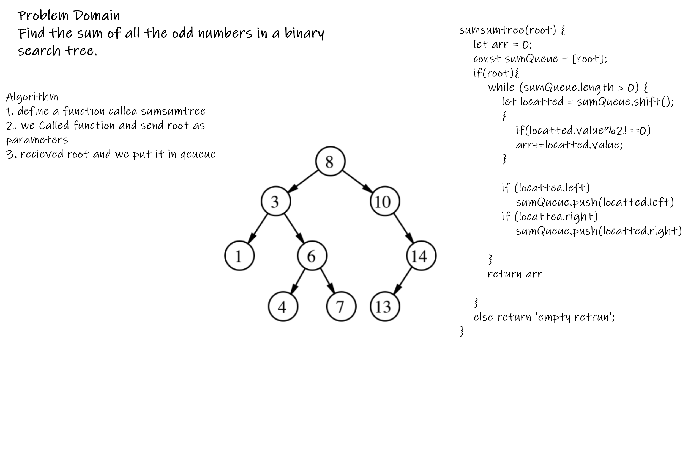

Interview 

Sum of numbers in a binary tree

Specifications
Read all of the following instructions carefully.
Act as an interviewer, giving a candidate a code challenge
Score the candidate according to the Whiteboard Rubric
You are free to offer suggestions or guidance (and see how they respond), but don’t solve it for the candidate
Feature Tasks
Describe to the candidate the following problem:
Find the sum of all the odd numbers in a binary search tree. 
Any of the traversals (depth or breadth) will work for this

 
 