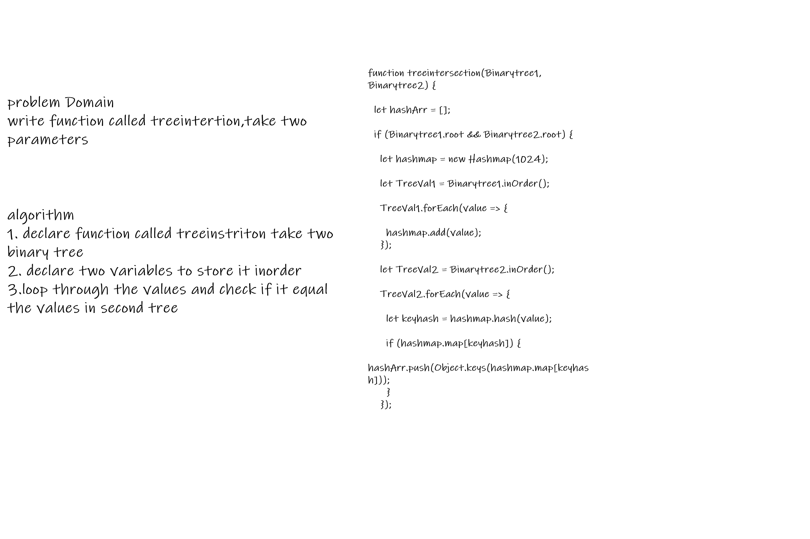

### Challenge:

  * Write a function called treeInterSection that takes two binary tree parameters.

  * Without utilizing any of the built-in library methods available to your language, return a set of values found in both trees.
  
##### Approach

1. I understood the problem first
2. I imagined how the results should be
3. I made a drawings of how the hashTable would be after insertion of multiple key and values.
4. I wrote the code
5. I made the tests

##### Efficiency

 space : O(n)
 time :O(n)

  
 