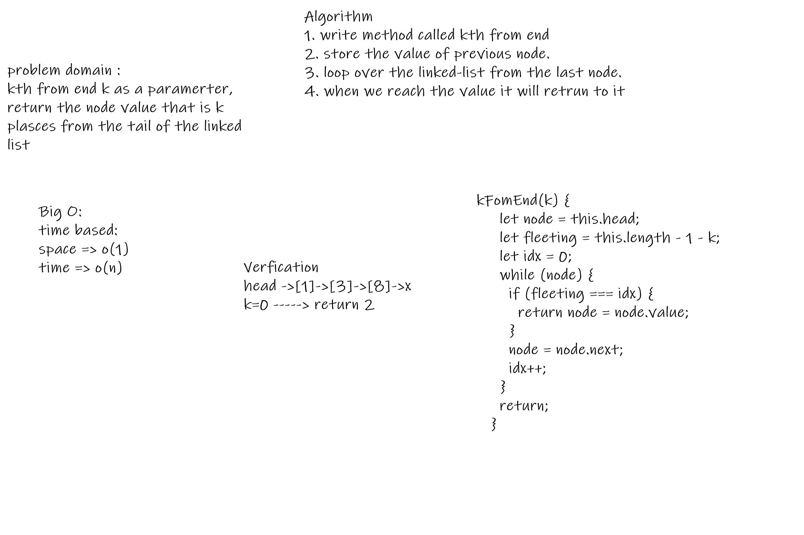

### Code Challenge

- k-th value from the end of a linked list.

### Specifications
- Read all of these instructions carefully.
1. Name things exactly as described.
2. Do all your work in a your data-structures-and-algorithms public 
 repository.
3. Create a new branch in your repo named as noted below.

- Follow the language-specific instructions for the challenge type listed below.
- Update the “Table of Contents” - in the README at the root of the repository - with a link to this challenge’s README file.

Challenge Setup & Execution

Branch Name: linked-list-kth

Challenge Type: Extending an Implementation

Feature Tasks
Write the following method for the Linked List class:

kth from end
argument: a number, k, as a parameter.
Return the node’s value that is k places from the tail of the linked list.
You have access to the Node class and all the properties on the Linked List class as well as the methods created in previous challenges.

