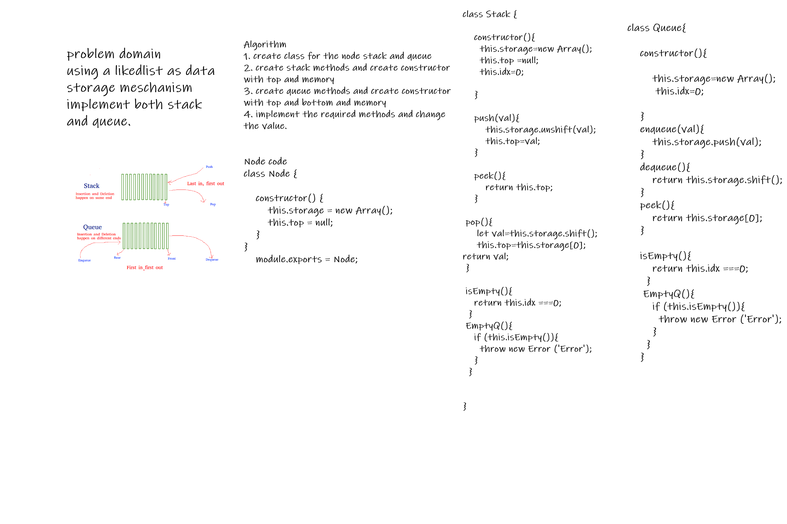

### Implementation: Stacks and Queues

##  Specifications
- Read all of these instructions carefully.
- Name things exactly as described.
- Do all your work in a your data-structures-and-algorithms public r- epository.
- Create a new branch in your repo named as noted below.
- Follow the language-specific instructions for the challenge type listed below.
- Update the “Table of Contents” - in the README at the root of the repository - with a link to this challenge’s README file.
Challenge Setup & Execution
Branch Name: stack-and-queue

- Challenge Type: New Implementation

 
 