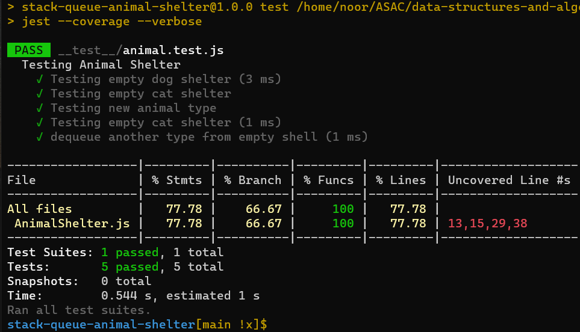

## Code Challenge

### First-in, First out Animal Shelter.

### Specifications
- Read all of these instructions carefully.
- Name things exactly as described.
- Do all your work in a your data-structures-and-algorithms public repository.
- Create a new branch in your repo named as noted below.
- Follow the language-specific instructions for the challenge type listed below.
- Update the “Table of Contents” - in the README at the root of the - repository - with a link to this challenge’s README file.
- Challenge Setup & Execution

- Branch Name: stack-queue-animal-shelter

 
 